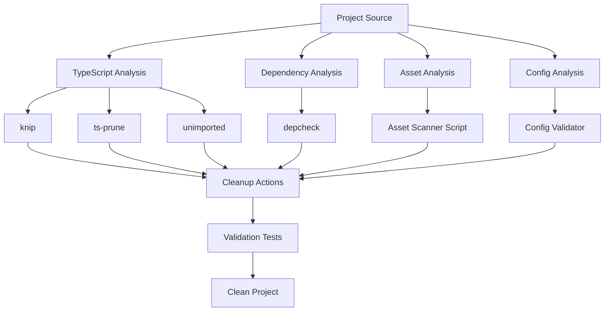

# Design Document

## Overview

This design outlines a systematic approach to audit and simplify an Expo + React Native + Firebase project. The solution uses a combination of static analysis tools, configuration normalization, and automated cleanup scripts to eliminate dead code, unused dependencies, and unnecessary assets while maintaining MVP functionality for Android and Web platforms.

## Architecture

### Analysis Pipeline

The cleanup process follows a multi-stage pipeline:

1. **Static Analysis Stage**: Use TypeScript compiler and linting tools to identify unused code
2. **Dependency Analysis Stage**: Analyze package.json and actual imports to find unused dependencies  
3. **Asset Analysis Stage**: Cross-reference asset files with code references
4. **Configuration Cleanup Stage**: Normalize and minimize configuration files
5. **Validation Stage**: Ensure the cleaned project still functions correctly

### Tool Integration



## Components and Interfaces

### 1. TypeScript Configuration Manager

**Purpose**: Configure and validate strict TypeScript settings

**Interface**:
```typescript
interface TypeScriptConfig {
  updateTsConfig(): Promise<void>;
  validateStrictMode(): Promise<boolean>;
  checkCompilation(): Promise<CompilationResult>;
}

interface CompilationResult {
  success: boolean;
  errors: string[];
  warnings: string[];
}
```

**Implementation**: Updates `tsconfig.json` with strict settings and validates compilation

### 2. Dependency Analyzer

**Purpose**: Identify and remove unused dependencies

**Interface**:
```typescript
interface DependencyAnalyzer {
  scanUnusedDependencies(): Promise<string[]>;
  scanMissingDependencies(): Promise<string[]>;
  removeUnusedDeps(deps: string[]): Promise<void>;
}
```

**Tools Used**:
- `depcheck`: Find unused and missing dependencies
- `knip`: Find unused files and exports
- `unimported`: Find unimported modules
- `ts-prune`: Find unused TypeScript exports

### 3. Asset Manager

**Purpose**: Remove unreferenced assets

**Interface**:
```typescript
interface AssetManager {
  scanReferencedAssets(): Promise<string[]>;
  scanAllAssets(): Promise<string[]>;
  removeUnusedAssets(assets: string[]): Promise<void>;
}
```

**Implementation**: Custom Node.js script that:
- Scans all TypeScript/JavaScript files for asset references
- Compares with actual files in `assets/` directory
- Identifies and removes unused assets

### 4. Configuration Normalizer

**Purpose**: Clean and optimize configuration files

**Interface**:
```typescript
interface ConfigNormalizer {
  cleanExpoConfig(): Promise<void>;
  cleanEasConfig(): Promise<void>;
  cleanFirebaseConfig(): Promise<void>;
  validateConfigs(): Promise<ValidationResult>;
}
```

**Targets**:
- `app.json`/`app.config.js`: Remove unused keys, validate required settings
- `eas.json`: Keep only active build profiles
- `firebase.json`: Remove unused services
- `firebaseConfig.ts`: Export only necessary configuration

### 5. Script Organizer

**Purpose**: Clean up development scripts and tools

**Interface**:
```typescript
interface ScriptOrganizer {
  identifyDebugScripts(): Promise<string[]>;
  moveToTools(scripts: string[]): Promise<void>;
  cleanPackageScripts(): Promise<void>;
}
```

**Actions**:
- Move `debug-*.ts` files to `tools/` directory or remove if unused
- Clean up `package.json` scripts
- Organize development utilities

## Data Models

### Cleanup Report

```typescript
interface CleanupReport {
  removedFiles: string[];
  removedDependencies: string[];
  removedAssets: string[];
  configChanges: ConfigChange[];
  errors: string[];
  warnings: string[];
}

interface ConfigChange {
  file: string;
  action: 'removed' | 'modified' | 'added';
  description: string;
}
```

### Analysis Results

```typescript
interface AnalysisResults {
  deadCode: {
    files: string[];
    exports: string[];
    imports: string[];
  };
  dependencies: {
    unused: string[];
    missing: string[];
  };
  assets: {
    unused: string[];
    referenced: string[];
  };
  configs: {
    issues: ConfigIssue[];
    suggestions: string[];
  };
}
```

## Error Handling

### Recovery Strategies

1. **Backup Creation**: Create git branch or backup before cleanup
2. **Incremental Cleanup**: Process one category at a time with validation
3. **Rollback Capability**: Maintain ability to revert changes
4. **Safe Mode**: Option to preview changes without applying them

### Error Categories

1. **Compilation Errors**: TypeScript compilation failures after cleanup
2. **Runtime Errors**: Application fails to start after cleanup
3. **Build Errors**: Expo/EAS build failures
4. **Configuration Errors**: Invalid configuration after cleanup

### Validation Checkpoints

```typescript
interface ValidationCheckpoint {
  name: string;
  check: () => Promise<boolean>;
  rollbackAction?: () => Promise<void>;
}

const checkpoints: ValidationCheckpoint[] = [
  {
    name: 'TypeScript Compilation',
    check: () => runTypeScriptCheck(),
    rollbackAction: () => restoreTsConfig()
  },
  {
    name: 'Application Startup',
    check: () => testAppStartup(),
    rollbackAction: () => restorePackageJson()
  },
  {
    name: 'Firebase Connection',
    check: () => testFirebaseConnection(),
    rollbackAction: () => restoreFirebaseConfig()
  }
];
```

## Testing Strategy

### Static Testing

1. **TypeScript Compilation**: `tsc --noEmit` with strict settings
2. **Linting**: ESLint with unused variable detection
3. **Dead Code Analysis**: knip, ts-prune, unimported tools
4. **Dependency Analysis**: depcheck validation

### Dynamic Testing

1. **Smoke Tests**: 
   - Web: `pnpm start` and basic navigation
   - Android: Emulator startup and core functionality
2. **Firebase Integration**: Basic read/write operations
3. **Build Tests**: Ensure builds still work after cleanup

### Test Automation

```typescript
interface TestSuite {
  runStaticTests(): Promise<TestResult[]>;
  runSmokeTests(): Promise<TestResult[]>;
  runBuildTests(): Promise<TestResult[]>;
}

interface TestResult {
  name: string;
  passed: boolean;
  error?: string;
  duration: number;
}
```

### Platform-Specific Validation

1. **Android**: 
   - APK build succeeds
   - App launches on emulator
   - Firebase Auth works
   - Firestore operations work

2. **Web**:
   - Static export succeeds
   - App loads in browser
   - Navigation works
   - Firebase integration works

## Implementation Phases

### Phase 1: Preparation and Analysis
- Set up analysis tools (knip, depcheck, etc.)
- Configure strict TypeScript settings
- Run initial analysis and generate reports

### Phase 2: Safe Cleanup
- Remove unused dependencies
- Clean up dead code (with dynamic import protection)
- Remove unused assets

### Phase 3: Configuration Optimization
- Normalize Expo configuration
- Clean EAS build profiles
- Optimize Firebase configuration

### Phase 4: Validation and Documentation
- Run comprehensive tests
- Update README and documentation
- Create cleanup report

## Security Considerations

1. **Environment Variables**: Ensure no sensitive data is exposed in cleaned configs
2. **Firebase Keys**: Validate that only necessary Firebase configuration is exported
3. **Build Secrets**: Ensure EAS configuration doesn't expose sensitive build information
4. **Asset Security**: Verify that removed assets don't include required certificates or keys

## Performance Impact

### Expected Improvements

1. **Bundle Size**: Reduced by removing unused assets and dependencies
2. **Build Time**: Faster builds due to fewer dependencies and files
3. **Development Experience**: Cleaner codebase with better TypeScript checking
4. **Maintenance**: Easier to maintain with normalized configuration

### Metrics to Track

- Bundle size before/after cleanup
- Number of dependencies removed
- Number of files removed
- TypeScript compilation time
- Build time improvements